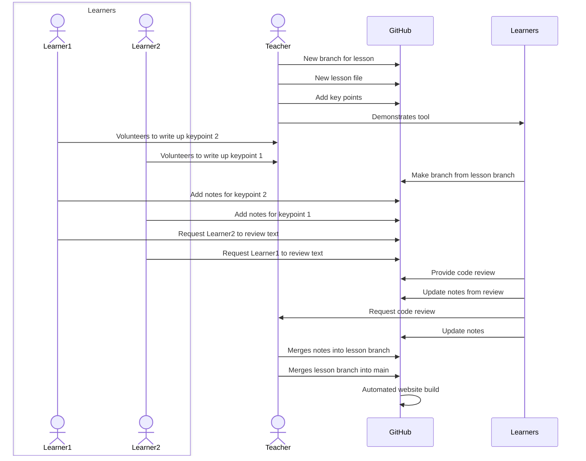

# Training-Tech-shorts
Short lessons, training various technologies useful to our work.

Lessons located at https://nbisweden.github.io/Training-Tech-shorts/.

## Background

This repository is intended to be used as a training tool, which
compiles knowledge over time.

Issues are made for a core set of tools to be taught, and what
the scope of those lessons should be. Each lesson should be
about 30 minutes in length, and is taught through demonstration.

Learners are then asked to assign themselves to write up a part
of the lesson. Another learner is assigned to be a reviewer of
that text. This allows the notes to focus on what was important
from the Learners' perspective, rather than the Teachers'. Once
both learners agree on the text, the Teacher reviews it for
accuracy. The text is then used as reference for recap lessons,
and to guide future focus. For example if there was something
the Teacher found easy to grasp, but learners had difficultly,
the teacher can focus on that another time (highlighted through
feedback and/or review process).

Lessons are aimed to be delivered weekly for regular practice.
The lessons should take up no more than two hours per week for everyone,
including preparation, writing, and review. The workload is intended
to be shared by all to make this manageable.

The target is the whole team, including the managers, as well
as the bioinformaticians. Having the managers there firstly highlights
the importance of the regular training, but also informs them of the
teams capabilities with the core technology stack (some of which may
be useful to the manager too). Regular communication through this
learning track is also meant to foster better collaboration and
provide an environment where people feel comfortable asking questions.

The features provided by Github are useful to enable these actions.
Issues are used to decide lessons. Branches are used to draft
an outline with key points by the teacher. Learners can make a draft
pull request to the lesson branch, where they can set themselves
as assignee, and request reviewers. The code review panel allows
for the learners and teachers to review the content before merging
it back into the branch. Github actions takes care of publishing
the notes into a presentable website for future reference.
This would then be the first lesson to teach.

