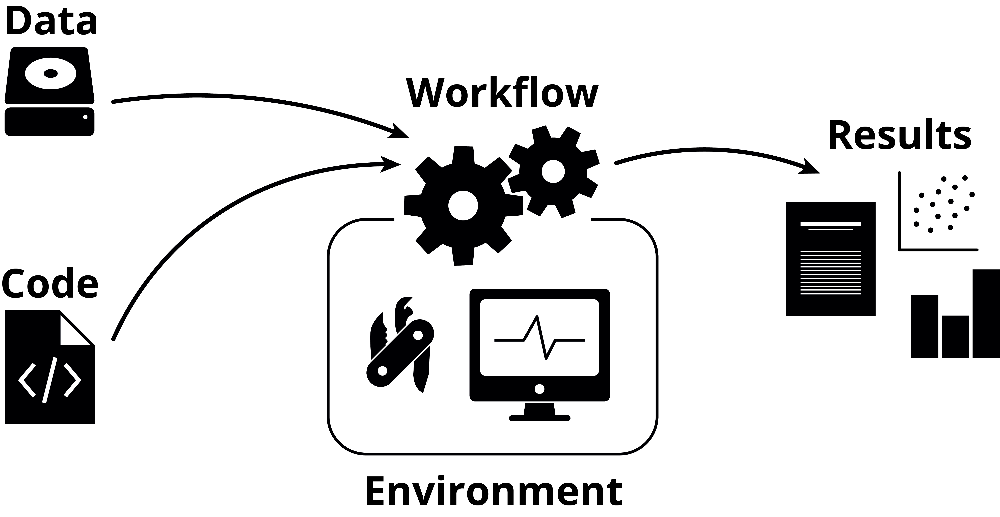

## Introduction

This material focuses on general information about reproducibility, _i.e._ why
you should work reproducibly, what it means to work reproducibly, how to start,
and so on. There will be no practical examples in this material itself, contrary
to most other RSE Tech Group write-ups, but links to the plethora of material
NBIS already has will be given throughout when appropriate.

## What does reproducibility mean?

It's important to know exactly what we mean when we talk about reproducibility,
as there are several related concepts that often get mixed up with it:

<center>
<table>
<tr>
  <td colspan="2" bgcolor="#FFFFFF" style="border-bottom: none"></td>
  <td colspan="2" align="center" bgcolor="#77c1ac">Data</td>
</tr>
<tr>
  <td colspan="2" bgcolor="#FFFFFF"></td>
  <td align="center" bgcolor="#96cfbf">Same</td>
  <td align="center" bgcolor="#96cfbf">Different</td>
</tr>
<tr>
  <td rowspan="2" bgcolor="#77c1ac">Code</td>
  <td align="center" bgcolor="#96cfbf">Same</td>
  <td align="center" bgcolor="#b9dfd4">Reproducible</td>
  <td align="center" bgcolor="#b9dfd4">Replicable</td>
</tr>
<tr>
  <td align="center" bgcolor="#96cfbf">Different</td>
  <td align="center" bgcolor="#b9dfd4">Robust</td>
  <td align="center" bgcolor="#b9dfd4">Generalisable</td>
</tr>
</table>
</center>

So, reproducibility is using the _same_ data and the _same_ code to get the
_same_ results. This sounds easy in theory, but is often harder in practice.

## Why should you work reproducibly?

- It's **good scientific practice** and something that should go into or
  be referenced in the _Materials & Methods_ section in the paper.
- It helps you to be **organised and structured** if you aren't already, which
  can make the work smoother and have less friction.
- It makes **fixing errors** both easier and quicker.
- It will help both you and your collaborators more **easily understand** the
  whole of the project's scope, steps and results - which is more often than
  you think highly relevant for the _future you_.
- It will **save you time** by working more efficiently.

## Your time and reproducibility

Something that is often talked about when it comes to reproducibility is the
_time_ it takes. While learning something new always takes time, once you've
gotten used to working reproducibly you will actually _save_ time, even though
you are most likely doing more things. Working reproducibly is, perhaps
non-intuitively, more time-efficient than not doing so.

::: {.callout-tip title="Reproducibility at NBIS"}
In the context of NBIS Support, we are _supposed_ to spend time on working
reproducibly, and this time is part of the project's support hours - _i.e._
working reproducibly is part of the scientific work we do for the groups we
consult for. While we cannot be responsible for the project as a whole, we _are_
responsible for the bioinformatics analyses we perform, and they need to be
reproducible. You can find more information about this at the [NBIS
reproducibility guidelines](https://github.com/NBISweden/Reproducibility-Guidelines).
:::

## An overview of reproducibility

{width=400px fig-align="center"}

There are generally three parts to working reproducibly:

 1. Your code
 2. Your environment
 3. Your workflow

::: {.callout-tip title="Data management"}
Additionally, there's your data (which, arguably, should be number zero), but
correctly storing this with backups has more to do with _data management_ than
reproducibility.
:::

There are many different solutions and tools for each of these steps, and which
one you choose varies from person to person. The important thing is not exactly
_which_ solution or tool you pick, but rather that you pick _something_. The
chosen solutions or tools of one person can differ to both small and large
extents to somebody else, and this is totally fine, as long as the end-goal of
reproducibility is achieved.

Another important point is that **reproducibility is not binary**, but rather a
gradient: you can, for example, do well in one area and worse (or nothing at
all) in another. Maybe you don't achieve the idealised version of "perfect"
reproducibility, but maybe you've gotten somewhere along the way there. We
should absolutely strive to get all the way there, but don't be discouraged by
feelings of not doing enough at this particular moment, just keep working at it
and learn more as you go.

::: {.callout-tip title="N.B."}
While this material lists several of the tools that can help you with each of
these steps, it is not aimed to go through them in any detail whatsoever. This
material talks about reproducibility at a higher level, and links to further
reading are instead given for you to delve deeper wherever you deem necessary.
:::

## Your code

You need to organise and store your code somehow so that you or somebody else
can either re-use or explore it later. Somebody unfamiliar with your code should
be able to understand what it is doing, given a familiarity with the field in
which you are working.

#### Get organised

You should _organise_ everything related your project. Stick to one
self-contained directory per project, where you keep everything related to that
project. Exactly _which_ organisational structure you pick matters less than
that you organise in the first place. Be consistent, be descriptive. The
structure will be different depending not only on your tastes, but also on which
tools you use.

An example of a simple project directory structure could look like this:

```bash
code/             Code needed to go from input files to final results
data/             Raw data - this should never edited
doc/              Documentation of the project
env/              Environment-related files
results/          Output from workflows and analyses
README.md         Project description and instructions
```

It's important to document how your project is structured so that others can also navigate your project. Click here to learn more: [Documentation @ Tools for Reproducible Research](https://nbisweden.github.io/workshop-reproducible-research/pages/documentation.html)

#### Version control

[Git](https://git-scm.com/) is a _version control system_ that allows you to
keep track of your code and changes done to it over time. This is the _de facto_
standard used in bioinformatics and software engineering at large.

 - [Git @ Tools for Reproducible Research](https://nbisweden.github.io/workshop-reproducible-research/pages/git.html)
 - [Git @ RSE Tech Group](https://nbisweden.github.io/Training-Tech-shorts/posts/2024-03-19-git-intro/)

::: {.callout-tip title="Using GitHub at NBIS"}
If you use the NBISweden GitHub organisation to store your projects, you should
name the repository on the `<PROJECT TYPE>-<REDMINE ISSUE>-YY-<SHORT NAME>`,
where the project type is `UF` for user fee projects and `PR` for peer review
projects. The short name should ideally only be a single or two words that
relate to the project somehow. An example is `UF-7235-24-kidney`.
:::

#### Literate programming

[Quarto](https://quarto.org/) and [Jupyter](https://jupyter.org/) are
_computational notebooks_ that allow you to combine code together with Markdown
in a seamless way.

 - [Quarto @ Tools for Reproducible Research](https://nbisweden.github.io/workshop-reproducible-research/pages/quarto.html)
 - [Jupyter @ Tools for Reproducible Research](https://nbisweden.github.io/workshop-reproducible-research/pages/jupyter.html)
 - [Quarto @ RSE Tech Group](https://nbisweden.github.io/Training-Tech-shorts/posts/2024-04-16-quarto-intro/)

## Your environment

Even if you've correctly stored and version controlled your code, that's no
guarantee that somebody else (or future you) will be able to actually execute
it, or that it yields the same results as when you wrote it. For this you need
to control the _computational environment_ within which the code is executed:
which packages are installed, with which versions, which dependencies, their
versions, and so on.

#### Package managers

There are many package managers out there that help you install and manage the
various packages in your environment. Some are for a particular language, while
others are language-agnostic. Conda could be considered industry standard for
this, but Pixi is gaining traction as a drop-in replacement and general
improvement upon it. An important thing that package managers should have is the
ability to create _lock files_, which are files containing a list of all the
packages, dependencies and their respective versions that have been installed.

 - [Conda @ Tools for Reproducible Research](https://nbisweden.github.io/workshop-reproducible-research/pages/conda.html)
 - [Pixi @ RSE Tech Group](https://nbisweden.github.io/Training-Tech-shorts/posts/2026-03-26-reintroduction-to-pixi/)
 - [Pixi on HPC centres @ RSE Tech Group](https://nbisweden.github.io/Training-Tech-shorts/posts/2025-11-13-pixi-tools-offline/)
 - [Working with R packages @ RSE Tech Group](https://nbisweden.github.io/Training-Tech-shorts/posts/2026-02-12-working-with-R-packages/)

#### Containers

While package managers control for your packages and their dependencies, they
_don't_ control the entire OS, which can affect portability. Containers solve
this, and additionally have a higher level of isolation, making the decoupling
from other environments easier. Working with and understanding containers
generally have a higher barrier of entry compare to package managers, but are
much more powerful once you do. Indeed, once you've started working with them
and feel more comfortable with them, they can actually be _easier_ to work with,
compared to package managers.

 - [Containers @ Tool for Reproducible Research](https://nbisweden.github.io/workshop-reproducible-research/pages/containers.html)
 - [Docker @ RSE Tech Group](https://nbisweden.github.io/Training-Tech-shorts/posts/2025-10-23-introduction-to-docker/)
 - [Apptainer @ RSE Tech Group](https://nbisweden.github.io/Training-Tech-shorts/posts/2024-06-04-apptainer-intro/)
 - [Container Registries @ RSE Tech Group](https://nbisweden.github.io/Training-Tech-shorts/posts/2025-06-10-container-registry-intro/)

## Your workflow

The word "workflow" here means "what you do, in what order, with what data". So,
what code are you running, in which environments, with which input data. This
can be solved with clear documentation (_e.g._ listing which scripts are run in
which order) or by using _workflow managers_.

#### Workflow managers

While workflow managers can have a similarly high barrier of entry as for
containers, they can also greatly facilitate iteration and exploration during a
project's lifetime, as they remove all manual work related to running scripts
with the correct inputs, parameters, and so on. Workflow managers are not only
useful for large, generalised production-level pipelines (such as those
available at [nf-core](https://nf-co.re/)), but can also be used for more
bespoke.

One great feature that workflow managers have is that they make environment
control a lot simpler, as each individual step in the workflow can have a
separate environment. This means fewer issues with package incompatibilities and
simpler dependency management overall. The two most common workflow managers for
bioinformatics, Nextflow and Snakemake, allow for using both Conda and
containers.

 - [Nextflow @ Tools for Reproducible Research](https://nbisweden.github.io/workshop-reproducible-research/pages/nextflow.html)
 - [Snakemake @ Tools for Reproducible Research](https://nbisweden.github.io/workshop-reproducible-research/pages/snakemake.html)
 - [Nextflow foundations @ RSE Tech Group](https://nbisweden.github.io/Training-Tech-shorts/posts/2025-11-27-nextflow-foundations/)
 - [When to use Nextflow @ RSE Tech Group](https://nbisweden.github.io/Training-Tech-shorts/posts/2025-05-13-nextflow-when-to-use/)
 - [Nextflow best practices](https://nbisweden.github.io/Training-Tech-shorts/posts/2025-12-11-nextflow-best-practices/)

## Where should you start?

If you don't work reproducibly today, or feel you are behind in some areas, it
can feel like a huge undertaking to even get started. Instead of feeling bad,
try instead to remember that **reproducibility is not binary**, and every little
step you take is a step in the right direction. Start with seeing where you have
the most to gain: for example, if you don't use Git, that's definitely a great
place to start. If you've already organised your projects and are using Git but
are missing environment control, start with Conda. Maybe you already use Quarto
or Jupyter for notebooks, but you want to combine it with a workflow manager.

It matters less where you currently are, and more where you want to do. Take one
thing at a time if it feels daunting, or dive deep and learn all the tools you
want in one go and incorporate them all into your daily work - it's all up to
you.

## Don't be afraid to experiment

There are quite a few tools and solutions that can help solve each of the three
parts of reproducibility, and it can be hard to know which tool or solution is
the best for you. Try them all out and experience them for yourself, and find
the one that you prefer.

Sometimes one tool neatly fits into how you are currently working, and that can
make the decision to pick that tool over another easy. Other times you may find
that no tool fits your current way or working, and you will have to adapt - if
you're lucky, you'll find a new way of working that you actually prefer over how
you did it before! Don't be afraid to experiment and take your pick of
everything you learn.

There is great value in seeing what others do, which tools they choose and how
they use them, _etc._ This shows you what you _could_ do, if you want, but it's
important to remember that not every solution a colleague is using may fit you
directly. Instead, try to see what others are doing, but adapt that to your own
needs as necessary.

## Make it your own

The way you work is your own, and you can make many of the tools work the way
_you_ prefer. Make a file with your most commonly used [Git
aliases](https://github.com/fasterius/dotfiles/blob/main/bash/bashrc#L146-L167),
explore new [VSCode extensions](https://marketplace.visualstudio.com/vscode)
that could give you cool new editing options, create a GitHub [template
repository](https://github.com/fasterius/nbis-support-template) for your
projects, start a [dotfiles](https://wiki.archlinux.org/title/Dotfiles)
[repository](https://github.com/fasterius/dotfiles) to store all your configs
in... Your way of working doesn't need to be set in stone, but can evolve along
with you and the new tools that are bound to come along.
