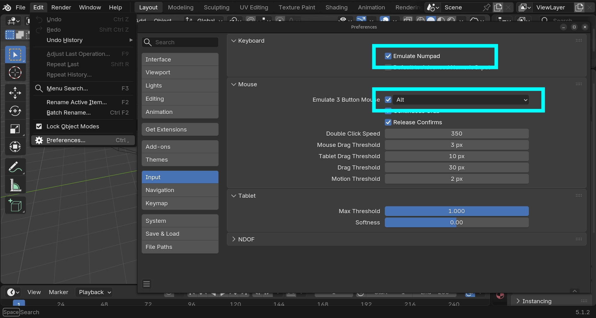
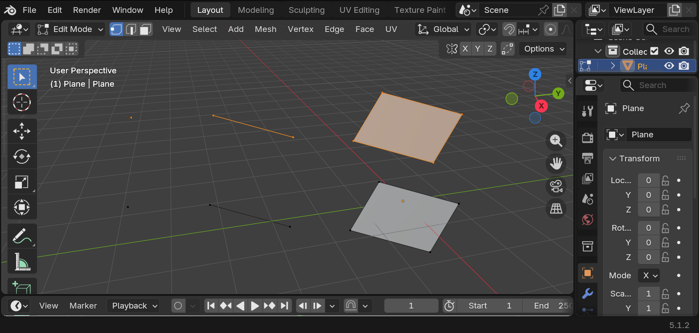
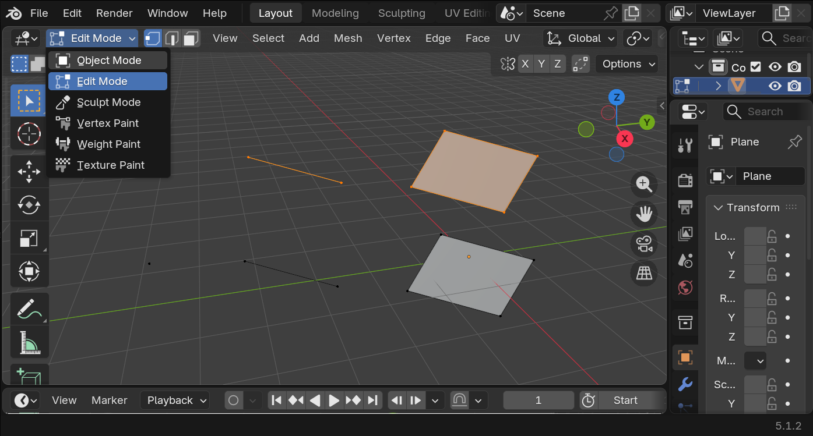
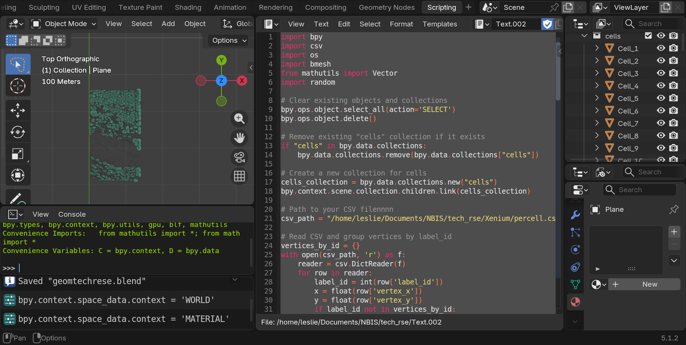
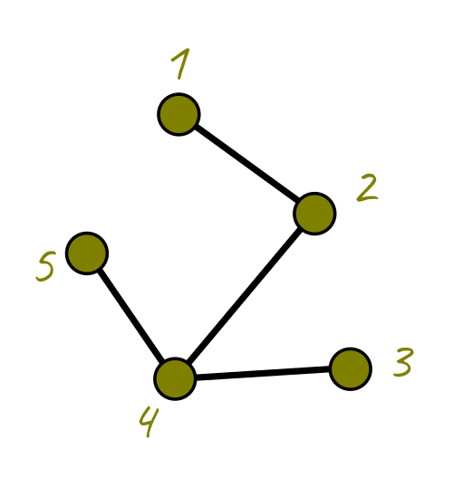
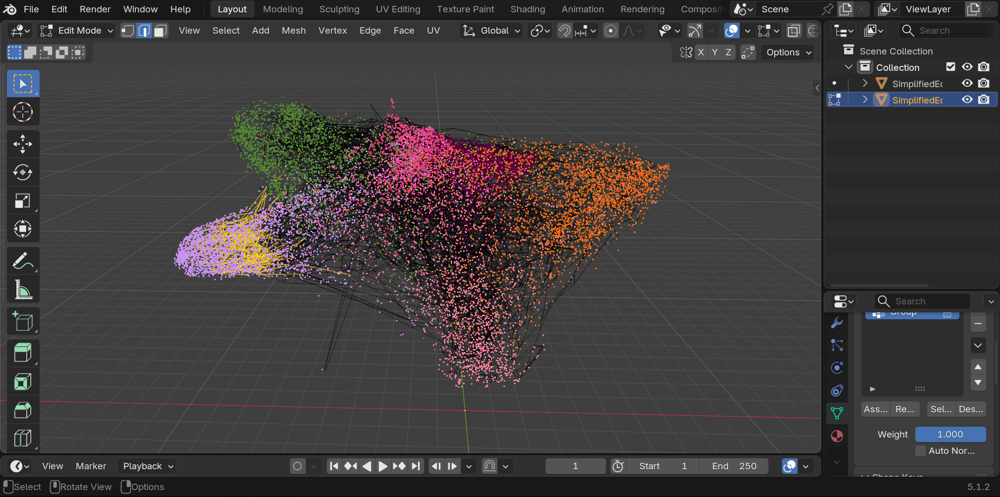
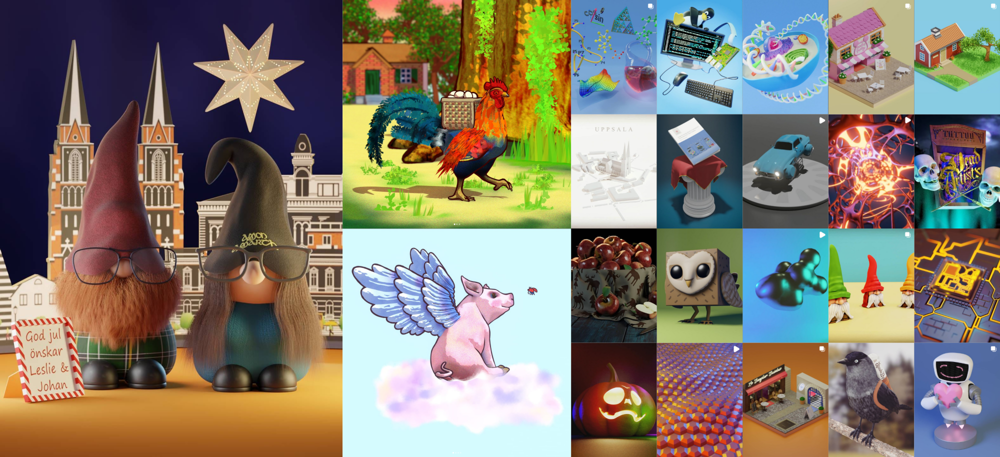

# Introduction

Blender is an open-source free software to do *computer graphics* a.k.a CG, CGI, VFX. Their slogan is **the freedom to create** and you can do anything you want with it, 2D, 3D, scientific visualization, data visualization, art, movies, video editing, architectural visualization, 3D printing etc. On top of that you can use python inside of it.

For this `#tech-group-rse-tools` presentation we used the latest Blender version **5.1.2.**, however everything we see here works exactly the same since version 2.8.0 which came out in 2020. The Blender team tries its best to be backwards compatible.

::: callout-tip

These keys and buttons are used throughout this article.  

Mouse:

- : Left Mouse Button  
- : Middle Mouse Button  
- : Right Mouse Button  

Keyboard:

    

       
:::  


::: callout-warning
## A mouse and numpad are recommended
In Blender it is much more comfortable to use a mouse. We will need the middle mouse button and wheel , and left  and right buttons . It also differentiates between numpad numbers and the row of numbers above the typical QWERTY keyboard.

It is not mandatory. If you don't have a mouse or numpad you can ask Blender to use the number row as a numpad and to emulate a click of the .

You can go to the `edit > preferences` menu and in the input section select to emulate the  and/or the numpad.

{width=95%}
:::

# A 3D world

## Get a feel of the place

In computer graphics, we have a world, a camera, and a light source. We can pan, rotate, and zoom in the world, like walking or flying in a videogame.

To rotate around the world, we press and drag . To pan, we press + and drag. To zoom in and out scroll .

### Rotate
{width=95%}

### Pan
{width=95%}

### Zoom
{width=95%}

## Objects and meshes

In Blender, the objects we can create are called meshes, and they will always be composed of: vertices, edges and faces. Vertices are 3D points with x,y and z coordinates. Edges are pairs of vertices, and faces are lists of vertices.

{width=95%}

To move, scale and rotate an object in Blender we use:

-  for scale
-  for rotate
-  for grabbing the object

### Scale
{width=95%}

### Rotate
{width=95%}

### Grab
{width=95%}

If we like the change, we click , if we don't like the change and we want to cancel, we press  or .


## Object and Edit modes

In the top left corner in Blender we see a "mode", amongst others, Object and Edit mode. In Object mode we can select all objects in the world. While in edit mode we edit the points, edges and faces of a single object or selected objects.

{width=95%}

## Enter Suzanne

Blender has a mascot! A cute monkey called Suzanne. We can add Suzanne to the world by pressing + and selecting the mesh menu and selecting Suzanne. Note that there are more objects, like cubes, spheres, cones and more. Never fear to explore!

{width=95%}

If you add something you don't like anymore, you can delete it with the  key or with  or selecting in the list to the right and pressing  or  or with  and selecting delete.

{width=95%}

## Punk is not dead

We are going to make Suzanne punk! To do that, we are going to select Suzanne and go into Edit mode. We are going to make sure to select faces (or all the points making the faces) of the head. To do this press  and click on the multiple faces where we will make Suzanne's punk hair.

{width=95%}

To elongate or extrude the hair upwards, we can press  but you may notice that all the faces grow lumped together. You can press  or  and then + to cancel the extrusion.

Instead we are going to look at the menu to the left while we are in Edit mode, and look for the extrude option, we press and let the menu open to select "Extrude individual faces". Now we can make each individual "punk hair" from the mesh faces in Suzanne's head. We drag them as high up as we want then click .

{width=95%}

Now we need to scale, but the same way we extruded each face individually, we will scale each face independently. To do so we go to the top middle menu and select a button called "Transform Pivot Point" and select "individual origins".

Then we can press  to scale the faces and we can tell it to scale it to zero by pressing  so Blender knows we want to scale it to zero. And voila, we have punk Suzanne.

{width=95%}

## Materials and colors

Let's make Suzanne more colorful, it's too gray and neutral. To the menu in the right, we can see the materials tab. This tab allows us to give Suzanne a new color.

We can color it all the same color or also select specific materials for specific faces. Let's start by coloring it with a brown diffuse color.

{width=95%}

To preview how the world looks in render mode, click in the top right menu the render Viewport shading.

In Edit mode, select faces like the internal part of the ears. Create a new material, make it pink, and then click the "assign" button to put it only in the selected faces. Do this with anything else you want, like the nose, eyes or mouth.

{width=95%}

## Let there be light

Finally, in computer graphics, in order to have a picture, we need light. Blender adds one by default but it is too weak, let's delete it and add the sun!

Press + and add a light > sun. Position it like any other object by grabbing with . Use the little yellow dot to rotate the sun and point to towards Suzanne. In the light menu to the right, change the color to a light yellow. Increase the strength to a value you like.

{width=95%}

Now that we're here, the world is too gray as well. We are going to go to the world tab, and change the color to a very light blue.

{width=95%}


## Say cheese!

Now it's time to take a picture! Which in computer graphics is called **rendering**. We are going to click in the camera and press x2 to rotate the camera in an easier way and try to point it to Suzanne. Grab it with  to move it around as well.

Now you are ready for your first digital picture, go to the render menu in the top and click "render image". You can save the resulting image. 

{width=95%}

Make sure to share it with us on the Slack `#tech-group-rse-tools`.

# Now let's get down to business

"I am a serious scientist, I want to do data and scientific visualization, I don't have no time for monkey business!"

Well you're in luck, because if your data has points, and polygons, (vertices and faces) then you can draw them in Blender and make use of their super powerful render engine.

During our `#tech-group-rse-tools` presentation I showed how I displayed Xenium cells and transcripts in Blender.

If your cells or nuclei are described by polygons, you can draw them in Blender

Make sure you have a CSV that looks like this


::: {.column width="50%"}

| label_id | vertex_x | vertex_y    |
|----|-----------|------|
| 1  | 313.31    |436.53|
| 1  | 1534.55   |982.23|
| 1  | 883.20    |415.36|
| 1  | 231.44    |752.83|
| 2  | 734.78    |987.78|
| 2  | 364.56    |541.84|
| 2  | 984.77    |865.38|
| 2  | 256.25    |348.28|

: Example cell or nuclei polygons
:::

In Xenium, the `cells.csv.gz` file contains exactly this style.

To create them in Blender as meshes we will use the following code in the scripting tab. 

{width=95%}

```python

import bpy
import csv
import os
import bmesh
from mathutils import Vector
import random

# Clear existing objects and collections
bpy.ops.object.select_all(action='SELECT')
bpy.ops.object.delete()

# Remove existing "cells" collection if it exists ----------------------------------
if "cells" in bpy.data.collections:
    bpy.data.collections.remove(bpy.data.collections["cells"])

# Create a new collection for cells ------------------------------------------------
cells_collection = bpy.data.collections.new("cells")
bpy.context.scene.collection.children.link(cells_collection)

# Path to your CSV file
csv_path = "/home/USER/Documents/NBIS/Xenium/percell.csv"

# Read CSV and group vertices by label_id ------------------------------------------
vertices_by_id = {}
with open(csv_path, 'r') as f:
    reader = csv.DictReader(f)
    for row in reader:
        label_id = int(row['label_id'])
        x = float(row['vertex_x'])
        y = float(row['vertex_y'])
        if label_id not in vertices_by_id:
            vertices_by_id[label_id] = []
        vertices_by_id[label_id].append((x, y, 0))  # z=0 for 2D polygons

# Create a separate mesh object for each polygon -----------------------------------
for label_id, verts in vertices_by_id.items():
    # Skip polygons with fewer than 3 vertices (invalid for faces)
    if len(verts) < 3:
        continue

    # Create a new mesh and object for this polygon
    mesh = bpy.data.meshes.new(f"Polygon_{label_id}")
    obj = bpy.data.objects.new(f"Cell_{label_id}", mesh)

    # Link the object to the "cells" collection
    cells_collection.objects.link(obj)

    # Create vertices and a single face
    vertices = verts
    faces = [tuple(range(len(verts)))]  # Single face for this polygon

    # Assign vertices and faces to the mesh
    mesh.from_pydata(vertices, [], faces)
    
    mesh.update()

# Fix the centers of all objects in "cells" collection -----------------------------
for obj in cells_collection.objects:
    if obj.type == 'MESH':
        # Calculate the centroid in world space
        world_centroid = Vector()
        for v in obj.data.vertices:
            # Convert vertex position to world space
            world_pos = obj.matrix_world @ v.co
            world_centroid += world_pos
        world_centroid /= len(obj.data.vertices)

        # Calculate the offset between the current origin and the new centroid
        current_origin_world = obj.matrix_world @ Vector()
        offset = world_centroid - current_origin_world

        # Move the mesh vertices by the inverse of the offset
        mesh = obj.data
        bm = bmesh.new()
        bm.from_mesh(mesh)
        for v in bm.verts:
            v.co -= offset
        bm.to_mesh(mesh)
        bm.free()

        # Update the object's location to the world centroid
        obj.location = obj.matrix_world.inverted() @ world_centroid

```

Since each cell is composed of points, they can become vertices in Blender, and we can fill them as a face for a mesh, then we can create the cells in blender, select them, color them, do anything we need, like render a figure for a paper.

Unless you are familiar and comfortable with Blender, I would continue to use R or Python to visualize things. Using Blender without being comfortable then it become like *killing a mosquito with a cannon*. If you really want to give it a shot, feel free to contact me :)

# Drawing a graph

Graphs are defined as nodes and edges. Nodes have coordinates, and we can plot them in Blender, and then we can join nodes as they are indicated in a list of edges. Normally, when we have them as text,  graphs are composed of two files, the nodes and the edges. Nodes are a list of ID, X and Y, and Z, and edges are node ID pairs.

Imagine we have the following graph

{width=50%}

Then the tables would look like this.

::: {.column width="50%"}
| node ID | ux | uy | uz|
|----|-----------|------|--|
| 1  | 314.4454  |31.38746| 1.0 |
| 2  | 376.7727  |76.99980| 1.0 |
| 3  | 393.1768  |148.4373| 1.0 |
| 4  | 312.7435  |152.9352| 1.0 |
| 5  | 272.2623  |95.25605| 1.0 |
:::

::: {.column width="50%"}
| edge n1 | edge n2    |
|----|------|
| 1  | 2    |
| 2  | 4    |
| 4  | 3    |
| 5  | 4    |
:::

I have a graph that has 100,000 nodes and millions of edges. Blender can draw it, but it becomes slow, and it's unnecessary to plot everything, so I plot a percentage of it with this code:

```python

import bpy
import numpy as np
import pandas as pd
import random

# Load coordinates from CSV
csv_path = "/path/to/your/coordinates.csv"
df = pd.read_csv(csv_path)
coords = df[['ux', 'uy', 'uz']].values

# Load edge pairs from .npy
npy_path = "/path/to/your/edges.npy"
edges = np.load(npy_path)

# --- Simplify: Remove a random fraction of nodes ---
fraction_to_remove = 0.2  # Remove 20% of nodes
num_nodes = len(coords)
num_to_remove = int(num_nodes * fraction_to_remove)

# Randomly select nodes to remove
nodes_to_remove = set(random.sample(range(num_nodes), num_to_remove))

# Create a list of remaining nodes and their new indices
remaining_nodes = [i for i in range(num_nodes) if i not in nodes_to_remove]
new_coords = [coords[i] for i in remaining_nodes]

# Create a mapping from old index to new index
old_to_new_index = {old: new for new, old in enumerate(remaining_nodes)}

# Update edges: only keep edges where both nodes are not removed
new_edges = []
for edge in edges:
    u, v = edge
    if u not in nodes_to_remove and v not in nodes_to_remove:
        new_edges.append((old_to_new_index[u], old_to_new_index[v]))

# --- Create mesh in Blender ---
mesh = bpy.data.meshes.new("SimplifiedEdgeMesh")
obj = bpy.data.objects.new("SimplifiedEdgeObject", mesh)
bpy.context.collection.objects.link(obj)

# Add vertices and edges
mesh.from_pydata(new_coords, new_edges, [])
mesh.update()

```

In the image, the black lines are the edges. The vertices are seen only as black dots, so I use an additional paid add-on to draw the dots that represent classes (such as classified cells). The image shows selected edges in yellow to see how much confusion there is from one class to another. That purple/lila cluster is dense and nicely separated from the rest, so this is a way to evaluate how well separated are the clusters in a model.

{width=95%}

# Summary and further resources

We hope you got a glimpse into the world of Blender and computer graphics. Everything in the 3D world is made of points, edges and faces, so if your data has any of these, you will be able to render it in Blender. 

Blender is a powerful suite. It might be, however, overkill for 2D scatterplots, you can still use matplotlib, seaborn, pandas, or ggplot for R. It is still worth mentioning Blender has a dedicated 2D space as well that uses vectors, like inkscape or Illustrator. In terms of Data Visualization, the true power of Blender can be appreciated when plotting big data that is spatially resolved, with millions of points, such as polygons representing cells and dots for transcripts, which can be done extremely fast in the 3D viewport, as we showed in the previous examples.

In the world of scientific visualization, Blender is king of free and open-source software. Anything related to simulations with realistic physics, smoke, fire, liquid simulation, geology, flock movements, the sky is the limit.

Here we add some more ideas of what NBIS and scientists could do with Blender in their RSE toolbelt:

### Structural Biology & Macromolecules
For those working on structural prediction and molecular dynamics simulations.

 - **Data Type:** Atomic coordinates and molecular trajectories.
 - **Blender Application:** 3D meshes of proteins, DNA, and RNA to animate molecular folding, ligand binding, and structural conformation changes.
 - **Pipeline:** Use the **[MolecularNodes](https://extensions.blender.org/add-ons/molecularnodes/)** add-on to import `.pdb` or `.mmCIF` files directly into Blender's Geometry Nodes.

### Bioimage Informatics & Cryo-EM
For those working with high-resolution imaging data from confocal microscopes, FIB-SEM, and Cryo-EM. 

 - **Data Type:** Multidimensional segmented meshes and volumetric image stacks.
 - **Blender Application:** Cinematic fly-throughs of cellular ultrastructures, organelle interactions, and 4D time-series cell division.
 - **Pipeline:** Use the **[Microscopy nodes](https://extensions.blender.org/add-ons/microscopynodes/)**. Or import segmented surface meshes (STL/OBJ) or use volumetric rendering techniques to map multi-channel TIFF stacks using Blender's Cycles engine.

### Medical Imaging (MRI & CT)
For clinical research requiring advanced tissue and organ segmentation.

 - **Data Type:** DICOM or NIfTI (`.nii`) volumetric scans.
 - **Blender Application:** Hyper-realistic 3D reconstruction of anatomical structures, bone-to-soft-tissue opacity mappings, and surgical planning animations.
 - **Pipeline:** Convert DICOM/NIfTI data into 3D meshes via software like 3D Slicer or OsiriX, or load the volumes directly into Blender using specialized add-ons like **[Scan visualizer](https://bbbn19.gumroad.com/l/qhldu)**.

### Spatial Transcriptomics & Tissue Mapping
For visualization of gene expression mapped to physical tissue coordinates.

 - **Data Type:** Coordinate matrices (X, Y, Z) paired with high-dimensional expression counts (`.h5ad`, CSV).
 - **Blender Application:** 3D scatter plots of thousands of single cells, color-coded by gene expression, superimposed over organ or tumor tissue models.
 - **Pipeline:** Use Blender's Python API (`bpy`) to read coordinate CSV files and procedurally instance spheres or particle systems.

### Networks & Phylogenetics
To visualize complex evolutionary trees and systems biology interaction networks.

 - **Data Type:** Newick tree formats or graph matrices.
 - **Blender Application:** Immersive, multi-layered 3D evolutionary trees and glowing, animated metabolic network graphs.
 - **Pipeline:** Pre-compute the 3D network coordinates in Python (using NetworkX), then script Blender to generate the connecting curves and node meshes.


# More resources

### Main website

<span style="font-size: 150%;"> <a href="https://www.blender.org"> https://www.blender.org</a> </span>

Some people were enthusiastic about other hobbies such as 3D printing or more highly detailed CAD so here are some resources.

[Video list for 3D prining](https://www.youtube.com/watch?v=JtDuLvJEIyQ&list=PLn3ukorJv4vsVYHvg3rjb6lAz1SvDi5xE)

[CAD (computer assisted design)](https://www.youtube.com/watch?v=CEG316zdd0k&list=PL7bmj43vr2FdKsaS8pT-3CDBOA1S7_U-S)

## Open movies

Blender studio has a purpose of making movies that are professional grade, everything is done using Blender and they serve as example for production of real films, all are open and can be watched at 

<table style="width: 100%; border-collapse: collapse;">
<tbody>
<tr>
   <td><a href="https://studio.blender.org/projects/singularity/" target="_blank"></a></td>
   <td><a href="https://studio.blender.org/projects/wing-it/" target="_blank"></a></td>
   <td><a href="https://studio.blender.org/projects/charge/" target="_blank"></a></td></tr>
<tr>
   <td><a href="https://studio.blender.org/projects/sprite-fright/" target="_blank"></a></td>
   <td><a href="https://studio.blender.org/projects/coffee-run/" target="_blank"></a></td>
   <td><a href="https://studio.blender.org/projects/spring/" target="_blank"></a></td></tr>
<tr>
   <td><a href="https://studio.blender.org/projects/hero/" target="_blank"></a></td>
   <td><a href="https://studio.blender.org/projects/dailydweebs/" target="_blank"></a></td>
   <td><a href="https://studio.blender.org/projects/agent-327/" target="_blank"></a></td></tr>
<tr>
   <td><a href="https://studio.blender.org/projects/caminandes-3/" target="_blank"></a></td>
   <td><a href="https://studio.blender.org/projects/glass-half/" target="_blank"></a></td>
   <td><a href="https://studio.blender.org/projects/cosmos-laundromat/" target="_blank"></a></td></tr>
<tr>
   <td><a href="https://studio.blender.org/projects/caminandes-2/" target="_blank"></a></td>
   <td><a href="https://studio.blender.org/projects/tears-of-steel/" target="_blank"></a></td>
   <td><a href="https://studio.blender.org/projects/sintel/" target="_blank"></a></td></tr>
<tr>
   <td><a href="https://studio.blender.org/projects/big-buck-bunny/" target="_blank"></a></td>
   <td><a href="https://studio.blender.org/projects/elephants-dream/" target="_blank"></a></td>
</tr>
</tbody>
</table>

## Examples of my art 

{width=95%}
